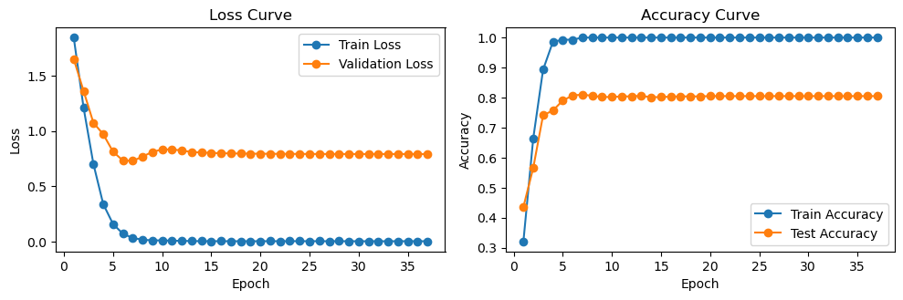

# The Basic version of Graph-Bert Model


----------------------------------------------------------
## How to run the code?

1. Environment settings:

To build the Docker image for the project based on docker file which we provided, run the following command in the project directory

```bash

docker build -t your-image-name 

``` 


2. In our scripts, we provide two ways to run it:

(1). JupyterLab: 

To run the script, simply execute the <ins>GBert_cora_full_procedure.ipynb</ins> notebook. This script works independently, without requiring any external file support.

(2). Python:

To run a script, 

```bash
python3 main_py.py

``` 

----------------------------------------------------------
## The procedure of our code?

(1) Data Fetching and Processing: In this step, we use a simple example Cora dataset to demonstrate the entire pipeline using the script <ins>step_1_processing.py</ins>.

(2) Graph-Bert Model Input preparation: (a) Node WL Code. (b) Intimacy-based Subgraph Batch. (c) Node Hop Distance. These inputs can be computed using the script <ins>script_2_subgraph.py</ins>.

(3) Graph-Bert parameters setting and data preparations: it is handled by <ins>script_3_setting.py</ins> and <ins>step_4_classification.py</ins>.

(4) Pretraining and Fine-tuning tasks for node classification check out our <ins>main_py.py</ins>. This script serves as the entry point for running the model.


----------------------------------------------------------
## Performance 



----------------------------------------------------------
### Following work
Based on this basic version, we have carried out the following work and applied it to Medical MRI imaging applications
it is located in the another project folder <ins>/GraphBert_MApp</ins>


----------------------------------------------------------
### Paper References from previous work
Paper URL at arXiv: https://arxiv.org/abs/2001.05140
